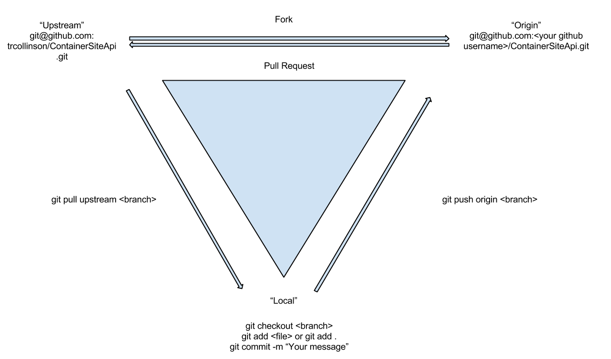

ContainerSiteApi
================

##What is this Container Site all about?

There are a number of solutions available for creating a web site with such things as content management, blogging, email address collection and management, and email marketing systems. However, many of these systems do not use industry leading best practices when it comes to testing, deployment, scaling, and operations management. This set of projects will work together to provide these features with a continual look towards industry best practices. 

###What are some the features that set you apart:

We aren't innovating as much as we are simply showing best practices in a number of key areas:

- Test Driven Development mentality
- Continuous Integration of changes
- Completely separate Front End and Back End API systems
- Containerized server deployments

###What are the projects?

**Container Site API:** This is a pure restful backend api for a content management system, blog, email address collection and management, and email marketing system. There is no front end, display, system tightly tied to this API. The API is built using Ruby and Ruby on Rails. By deploying it you can quickly have a full featured, tested system to handle all of these tasks for yourself. Build your own beautiful front end and connect to this API system or use the Container Site Frontend!

**Container Site Front End:** This is a completely independent front end for a content managed, blog style site which has the functionality needed to collect and manage user email addresses, and an email marketing system. This system is built using AngularJS. It hooks into the Container Site API but could easily use any API system that matches the well documented API signatures. Because the API connections are quite well documented, tested, and are separated from the sites business logic and view logic, they can be quickly changed to call other API systems easily.

**Docker Based Deployments:** We believe in quick, reliable, testable, and scalable deployment models. The Container Site API utilizes Docker to implement this level of deployment and DevOps. Feel free to push the API to any Docker enabled deployment environment, even locally! We'll even show you how to scale it on services like AWS Elastic Beanstalk.

**Compiled, Static Storage Front End Deployments:** Our Container Site Front End can easily be deployed to any static file storage environment for quick, distributed, and low cost distribution to your users. Grab a copy and with a few clicks you'll be able to deploy to storage environments like AWS S3.

**Continuous Integration:** By having our continuous integration environment, utilizing Jenkins, within a Docker container, you can use it as well. Want to make changes to the API or the Front end and quickly test the same way we do? Deploy the continuous integration container, make a few minor configuration changes, and you'll be testing. You can even use it on your own independent projects quickly and easily.


##How to contribute



We have a suggested workflow for contributing to this and other git based projects. Try it out!

- First use Github to Fork this project. In the upper right hand corner, click "Fork".
- On your own machine use `git clone` to clone your forked repo.
	- `git clone https://github.com/<your github username here>/ContainerSiteApi.git` 
- On your local machine, move to the ContainerSiteApi folder and add the main project as an upsteam repo.
	- `git remote -v` : this will show you your current remote repositories. Your forked version of the repo should be "origin".
	- `git remote add upstream https://github.com/trcollinson/ContainerSiteApi.git` : this will add the main repo as a new remote called upsteam.
	- `git remote -v` : you will now see 4 lines that look like the following:

		```
		origin  git@github.com:<your github username>/ContainerSiteApi.git (fetch)
		origin  git@github.com:<your github username>/ContainerSiteApi.git (push)
		upstream        git@github.com:trcollinson/ContainerSiteApi.git (fetch)
		upstream        git@github.com:trcollinson/ContainerSiteApi.git (push)
		```

- Checkout the development branch to start working on a change, bug, or feature you would like to see.
	- `git checkout development`
- Make sure to check for changes from the main project before you start development.
	- `git pull upstream development` : this will pull all changes from the main projects development branch into your local environment.
- When you are done, make sure to add your changes to a commit and commit them.
	- `git status` : to see which files have been marked by git as changed.
	- `git add <files you changed>` : to add your changed files to a commit or : `git add .` : to add all of your changed files to a commit.
	- `git commit -m "your message here"` : to commit the changes. Make sure your message is descriptive.
- Don't forget to check for changes from the main project before pushing your changes up.
	- `git pull upstream development` : again, this pulls changes from the main project down to your local. Make sure to fix any merge conflicts before moving to the next step. Feel free to ask for help if you need it!
- Now push to your fork. Do not try to commit directly to the main project.
	- `git push origin development` : this pushes your changes to your forked repo on github.
- Finally, make a pull request to add them to the main project.
	- Go to your forked repo on github and click on "Pull Requests" in the right hand menu. This will give you an option to make a pull request to the main project.

Note: If a maintainer of the main project makes a note for you to fix something on your pull request, you do not need to make a new pull request. Simply make more changes, commit them as above, and push them to your fork of the project. The new commit will automatically be added to the pull request.
